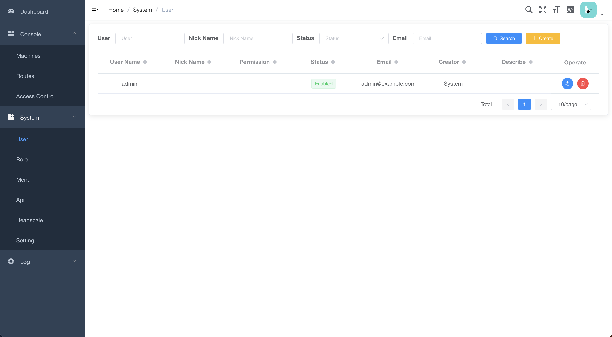
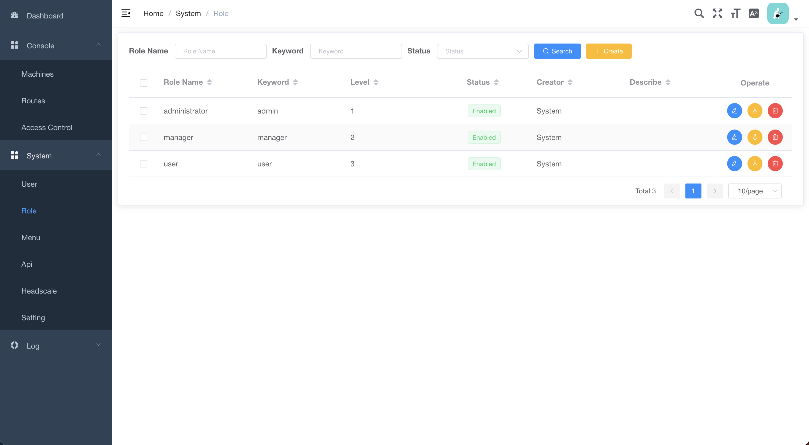
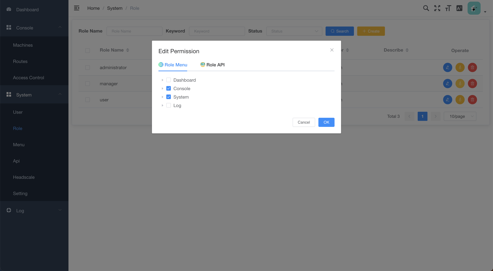
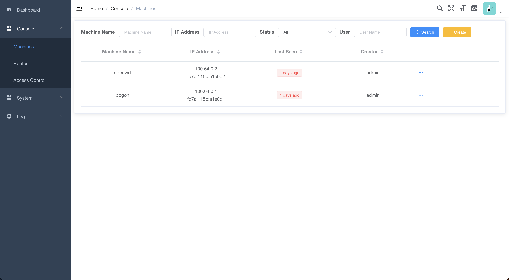
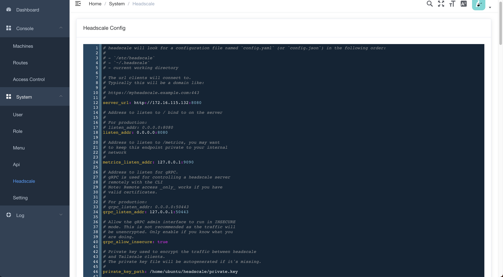
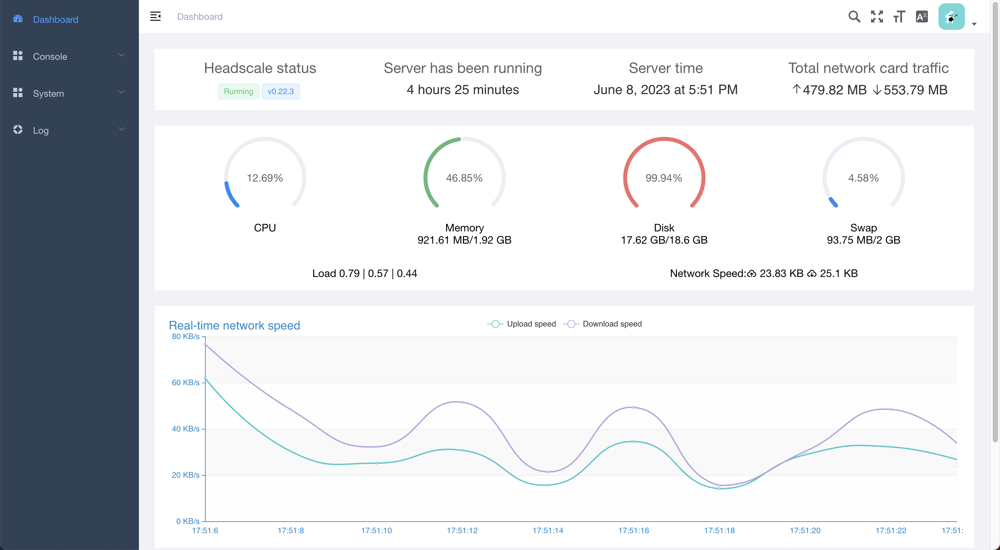

headscale-panel
===============

<div align="center"> This project is developed based on the go-web-mini project, using a management system scaffold built with Go + Vue. It follows a front-end and back-end separation approach, only including the necessary parts for project development. It incorporates role-based access control (RBAC), is well-structured with reasonable packages, and is concise and easy to expand. The backend in Go includes the use of gin, gorm, jwt, and casbin, while the frontend in Vue is based on vue-element-admin: https://github.com/QianheYu/headscale-panel-ui.git </div>

Features
--------

*   `Gin` is an API framework similar to martini but with better performance. It improves speed by nearly 40% by utilizing httprouter.
*   `Postgres` is used as the database, specifically PostgreSQL.
*   `Jwt` lightweight authentication using JWT and provides functionality for refreshing active user tokens.
*   `Casbin` is a powerful and efficient open-source access control framework that supports various access control models.
*   `Gorm` is developed using Gorm version 2.0 and includes operations such as one-to-many, many-to-many, and transactions.
*   `Validator` uses validator v10 for parameter validation, ensuring rigorous validation of incoming parameters from the frontend.
*   `Lumberjack` allows setting log file size, log retention count, log retention time, and compression, among other options.
*   `Viper` is a complete configuration solution for Go applications that supports hot configuration updates.
*   `GoFunk` is a utility package that includes a wide range of slice manipulation methods.

Middleware
----------

*   `AuthMiddleware` is an authentication middleware that handles login, logout, and stateless token validation.
*   `RateLimitMiddleware` is a token-bucket-based rate-limiting middleware that restricts the number of requests from users.
*   `OperationLogMiddleware` is an operation log middleware that records all user operations.
*   `CORSMiddleware` is a middleware for handling cross-origin resource sharing (CORS) to resolve cross-origin issues.
*   `CasbinMiddleware` is an access control middleware based on Casbin RBAC (Role-Based Access Control) that provides fine-grained control over API access.

About Me
-------------------------
This is my first official open source project, and I have little experience with it,
so if you have good advice or techniques, I look forward to talking to you, and you can start by submitting an issue.
If there is an architecture that doesn't fit or changes are significant, I will refactor in due course.

Installation Instructions
-------------------------

### Database Installation

You can install the database using either direct deployment or Docker. Here, we only provide instructions for Docker installation. If you have already installed the PostgreSQL database, you can skip this step.

Copy the `deploy/postgres/docker-compose.yml` file to the location where you want to store the database data files. Modify the file according to the instructions provided, and then execute the following command:

```shell
docker-compose up -d
```

### Prepare Configuration File

Modify the configuration file based on the documentation example.
You must copy the `rbac_model.conf` file and a pair of keys like `headscale-panel-pub.pem` `headscale-panel-priv.pem` to the same path as `config.yaml`
You can also generate your own key pairs to instead it. But you mustn't forget that you also need to change the contents of the credentials in the login and user pages in the front-end, they are in the [headscale-panel-ui](https://github.com/QianheYu/headscale-panel) project in `/src/views/login/index.vue` and `/src/views/system/user/index.vue`

### Installation of headscale-panel

You can choose one of the following two deployment methods:

#### Docker Deployment (Recommended)

Pull the Docker image:

```shell
docker pull yqhdocker/headscale-panel:latest
```

Initialize the database:

If you are starting up for the first time, you will need to set `init-data: true` in the `system` in the configuration file to initialise the database and make sure to change `init-data` to `false` after initialisation

> Note: If you have already initialized the database with headscale before installing headscale-panel, please use the script provided in the project to modify the database. [Instructions](./docs/InitDatabase.md)

Then you need to run
```shell
docker run -d --net=host -v /your/headscale-panel/config/path:/etc/headscale-panel -v /your/headscale/config/path:/etc/headscale --name=headscale-panel yqhdocker/headscale-panel:latest
```

#### Direct Deployment

Download the executable file from the Releases section and place it in `/usr/local/bin`.
Put the configuration file in the `/etc/headscal-panel` directory or use the `-c` parameter
during runtime to specify the configuration file.

Initialize the database:

If you are starting up for the first time, you will need to set `init-data: true` in the `system` in the configuration file to initialise the database and make sure to change `init-data` to `false` after initialisation

> Note: If you have already initialized the database with headscale before installing headscale-panel, please use the script provided in the project to modify the database. [Instructions](./docs/InitDatabase.md)

Then you need to run
```shell
headscale-panel
```

Set up the service manager:

```shell
# Example for Ubuntu Server: copy the systemd/headscale-panel.service file to /etc/systemd/system
systemctl daemon-reload
systemctl start headscale-panel
# Set to start on system startup
systemctl enable headscale-panel
```

### Deploy Frontend
[See in headscale-panel-ui](https://github.com/QianheYu/headscale-panel-ui.git)

### Two modes of operation
#### Standalone
In this mode, the operation of headscale will be taken over by headscale-panel.
headscale and headscale-panel will work on different ports, if you want them
to work on the same port, you need to use nginx or another program that can provide a reverse proxy.
[Here is an example](./docs/nginx.md)

See `config-example.yaml` for more.

#### Multi
Use this mode if you want to deploy headscale and headscale-panel in separate environments

See `config-example.yaml` for more.

### Default Administrator Account
 - Account: `admin`
 - Password: `123456`

Project Screenshots
-------------------









Project Structure Overview
--------------------------

```bash
├─common # Common resources such as casbin, postgresql, validator, etc.
├─config # Configuration file reading using viper
├─controller # Controller layer, methods that handle route requests
├─dto # Data structures returned to the frontend
├─log # Log use zap
├─middleware # Middleware
├─model # Struct models
├─repository # Database operations
├─response # Common response encapsulations, such as Success and Fail
├─routes # All routes
├─util # Utility methods
├─task # Methods to control and communicate for headscale
└─vo # Data structures for receiving requests from the frontend
```

Frontend Vue Project
--------------------
[https://github.com/QianheYu/headscale-panel-ui.git](https://github.com/QianheYu/headscale-panel-ui.git)

## MIT License

    Copyright (c) 2023 QianheYu

